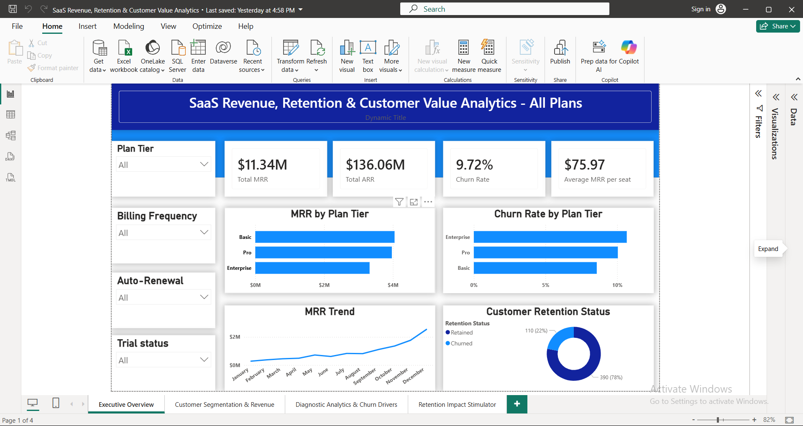
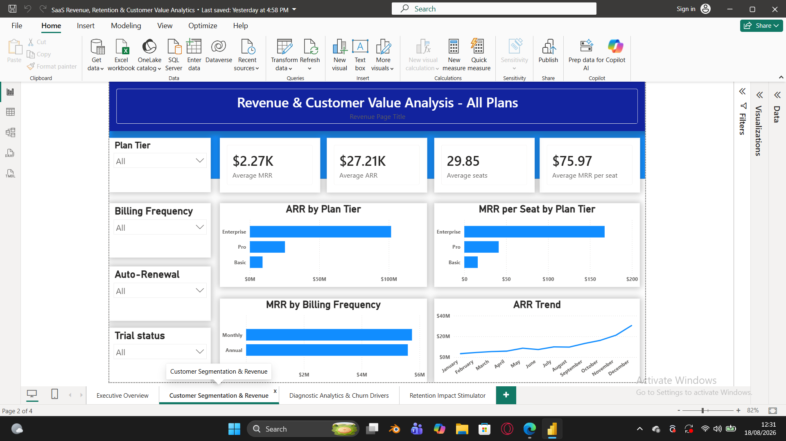
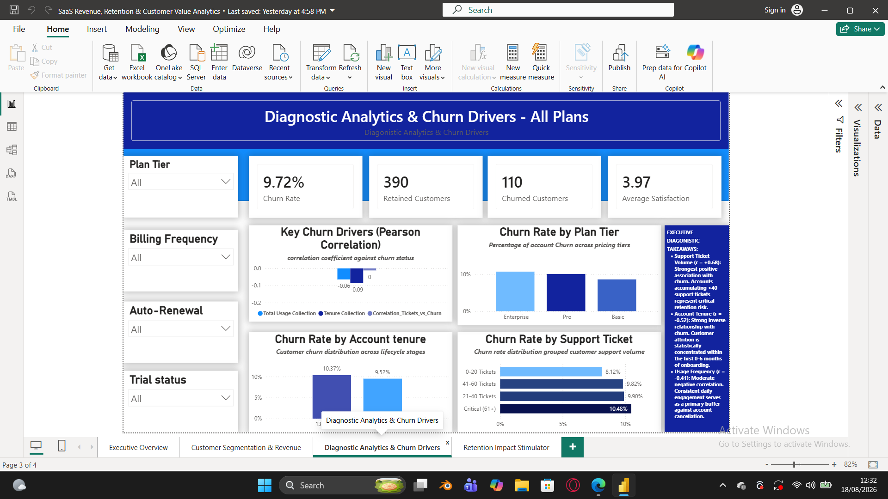
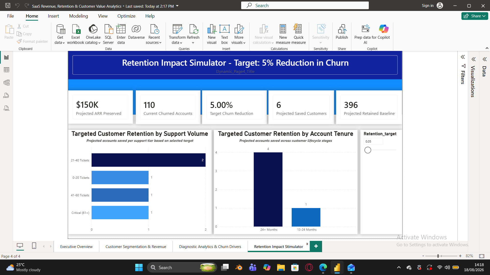

# 📊 SaaS Revenue, Retention & Predictive Churn Analytics


An end-to-end SaaS analytics and decision-support project designed to analyze revenue performance, customer retention, churn drivers, and the financial impact of improving customer retention.

The project combines **SQL Server, Python, statistical analysis, and Power BI** to move from raw customer data to actionable business recommendations and an interactive retention impact simulator.

---

## 🎯 Executive Summary

### The Business Problem

Customer churn directly affects recurring revenue, customer lifetime value, and revenue predictability.

The objective of this project was to determine:

- Where revenue is being generated and lost
- Which customer segments have elevated churn risk
- Which operational and customer-behavior factors are associated with churn
- Which customer lifecycle stages require greater retention attention
- How reducing churn could translate into financially protected ARR

### The Analytical Solution

The project uses a four-stage analytics workflow:

1. **SQL Server** — Data preparation, validation, transformation, and analysis
2. **Python** — Statistical analysis and churn-driver investigation
3. **Power BI** — Interactive business intelligence and executive reporting
4. **What-If Analysis** — Simulation of potential customer and ARR retention impact

---

# 💰 Key Business Impact

The retention simulator demonstrates the potential financial impact of a **5% churn-reduction target**.

### Example scenario

| Metric | Result |
|---|---:|
| Target churn reduction | **5%** |
| Projected saved customers | **6** |
| Projected ARR preserved | **~$150K** |
| Current churned accounts | **110** |

The projected ARR impact is based on the estimated average ARR per customer multiplied by the projected number of customers retained under the selected scenario.

> **Important:** The simulator is a decision-support model rather than a forecast of guaranteed financial results. The projected impact depends on the assumptions and selected retention scenario.

---

# 📊 Dashboard

## 1. Executive Overview

Provides a high-level view of SaaS revenue, customer activity, retention, and churn performance.



### Key questions answered

- How much recurring revenue is being generated?
- How many customers are active or churned?
- What is the overall churn rate?
- How does customer value vary across the customer base?

---

## 2. Revenue & Customer Value Analysis

Analyzes customer-level revenue and unit economics to understand the relationship between customers, ARR, MRR, seats, and customer value.



### Key questions answered

- Which customers contribute the greatest ARR?
- How does revenue vary across customer segments?
- What does average customer value look like?
- Which customer characteristics are associated with higher revenue?

---

## 3. Diagnostic Churn Analytics

Uses statistical analysis to investigate potential relationships between customer behavior, support activity, tenure, and churn.



### Key questions answered

- Which factors are associated with churn?
- Does support activity differ between retained and churned customers?
- Are newer customers more vulnerable to churn?
- Which customer segments require retention intervention?

### Statistical Analysis

Python was used to investigate relationships between relevant variables and churn using **Pearson correlation analysis**.

Correlation was used as a diagnostic technique to identify potentially important relationships. It does **not** establish causation.

---

## 4. Retention Impact Simulator

An interactive Power BI What-If analysis designed to estimate the potential business impact of reducing churn.



The simulator allows decision-makers to evaluate scenarios such as:

- Target churn reduction
- Projected customers saved
- Projected ARR preserved
- Customer retention across support-volume segments
- Customer retention across lifecycle/tenure segments

This transforms the analysis from a static reporting exercise into a **decision-support tool**.

---

# 🏗️ Data & Analytics Architecture

```text
                 RAW SaaS DATA
                       │
                       ▼
              ┌─────────────────┐
              │   SQL SERVER    │
              │                 │
              │ Data validation │
              │ Transformation  │
              │ Data extraction │
              └────────┬────────┘
                       │
                       ▼
              ┌─────────────────┐
              │     PYTHON      │
              │                 │
              │ Pandas          │
              │ Statistical     │
              │ Analysis        │
              │ Feature         │
              │ Engineering     │
              └────────┬────────┘
                       │
                       ▼
              ┌─────────────────┐
              │    POWER BI     │
              │                 │
              │ Data Model      │
              │ DAX Measures    │
              │ KPIs            │
              │ Interactive     │
              │ Visualizations  │
              └────────┬────────┘
                       │
                       ▼
              ┌─────────────────┐
              │ DECISION SUPPORT│
              │                 │
              │ Churn Drivers   │
              │ Retention       │
              │ What-If Model   │
              │ ARR Impact      │
              └─────────────────┘
🧰 Technologies Used
SQL Server
Used for:
Data extraction
Data validation
Data transformation
Aggregation
Analytical querying
Python
Used for:
Data cleaning
Feature engineering
Customer segmentation
Statistical analysis
Correlation analysis
Analytical calculations
Power BI
Used for:
Data modeling
DAX measures
KPI development
Interactive dashboards
Customer segmentation
What-If parameter analysis
Executive reporting
📈 Analytical Approach
The analysis followed an end-to-end workflow:
1. Data Preparation
Customer, subscription, revenue, usage, and support-related data were prepared for analysis.
2. Data Validation
SQL Server was used to inspect data types, relationships, missing values, and analytical consistency.
3. Feature Engineering
Customer lifecycle and behavioral variables were transformed into analytical features such as:
Tenure groups
Revenue metrics
Customer value metrics
Support-volume segments
Usage metrics
Churn indicators
4. Statistical Analysis
Python was used to investigate relationships between churn and selected customer/support variables using Pearson correlation.
5. Business Intelligence
The processed data was modeled in Power BI and converted into executive KPIs, diagnostic visuals, segmentation analysis, and interactive scenarios.
6. Retention Scenario Modeling
A What-If parameter was used to model potential churn-reduction scenarios and estimate their corresponding customer and ARR impact.
🔎 Key Insights
The analysis highlighted several areas that can be investigated from a retention-management perspective, including:
Customer tenure: Early-stage customers require particular attention because new customers may have greater retention vulnerability.
Support activity: Higher support-ticket volumes can be associated with increased churn risk and may indicate customer friction or unresolved issues.
Customer value: Losing high-value customers can have a disproportionate effect on recurring revenue.
Retention economics: Even a relatively small improvement in churn can translate into meaningful recurring-revenue protection.
These findings demonstrate how customer-level behavioral analysis can be connected directly to financial outcomes.
💡 Business Recommendations
Based on the analysis, a SaaS business could consider:
1. Strengthen Early-Lifecycle Retention
Create proactive onboarding and engagement programs for customers during their first several months.
2. Monitor High-Support Customers
Customers generating unusually high support volumes could be prioritized for proactive account review.
3. Prioritize High-Value At-Risk Customers
Retention teams should consider both churn probability and customer value when prioritizing interventions.
4. Measure Retention ROI
Retention initiatives should be evaluated not only by the number of customers saved but also by the amount of recurring revenue protected.
5. Use Scenario Planning
Decision-makers can use the retention simulator to evaluate different churn-reduction targets before committing resources to retention initiatives.
⚠️ Modeling Considerations
The retention simulator is designed as a scenario-analysis tool.
Projected ARR preservation depends on assumptions including:
Average customer ARR
Number of projected customers saved
Selected churn-reduction target
Therefore, the projected ARR value should be interpreted as an estimated financial impact, not guaranteed realized revenue.
Additionally, correlation analysis identifies statistical relationships but does not prove that a variable directly causes churn.
🚀 Project Objective
The goal of this project was not simply to create a dashboard.
It was to demonstrate an end-to-end analytical workflow that connects:
Data → Analysis → Statistical Evidence → Business Insight → Financial Impact → Decision Support
This approach demonstrates how data analytics can be used to support practical SaaS retention and revenue-management decisions.
👤 Author
Wisdom Odu
Aspiring Data Analyst focused on:
Data Analytics
Business Intelligence
SQL
Python
Power BI
Statistical Analysis
Decision-Support Analytics
📌 Project Status
Completed — Portfolio Project
Future improvements could include:
Predictive churn modeling using machine learning
Customer lifetime value modeling
Survival analysis
Automated data pipelines
Streamlit-based scenario modeling
More advanced retention ROI optimization

### One thing I want you to do **before anything else**

After you paste and commit that README, go back to the repository's main **Code** page.

You should see:

```text
01_Executive_overview.png
02_Revenue_customer_value.png
03_Diagnostic_churn.png
04_Retention_simulator.png
README.md

## Power BI Dashboard
The Power BI file contains the complete interactive dashboard, including:
- Executive revenue and retention analysis
-Customer segmentation and revenue analysis
- Churn diagnostics
-Retention impact simulator and what-if analysis
**Power BI File:**
'SaaS_Revenue_Churn_Analytics.phix
